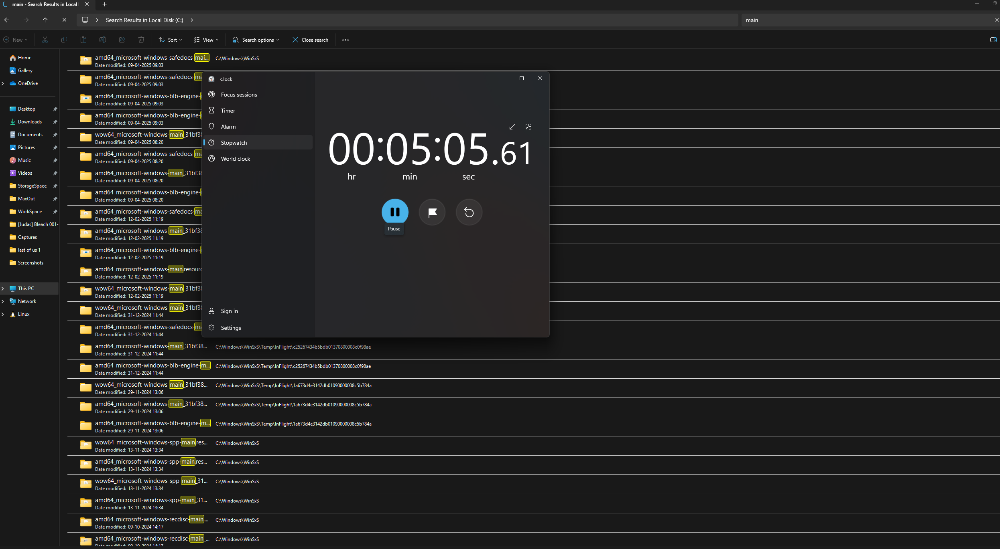
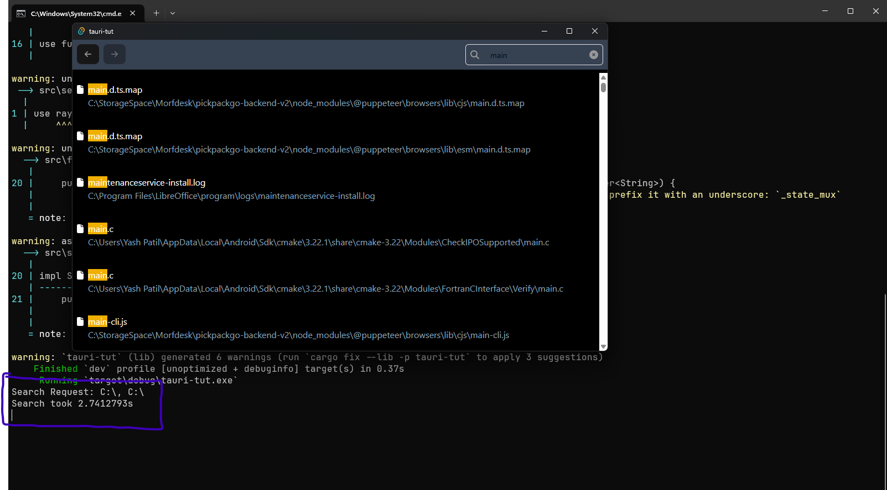

# Fearless Scan
We always think twice before searching anything in the windows explorer. That was my motivation behind this project, to build a very fast file scanner.

## Features
- Watches the filesystem forr any changes in realtime.
- Returns search results in no time.
- Does Fuzzy Matching while searching, windows does only exact matches.
- sorts the results by their fuzzy scores.
- We can navigate the file tree and search withing a particular directory
- Can open files from the search results

## Benchmarks
- Windows
  

- Fearless Scan
  

## To Run Locally
### prerequisites
- Node [link](https://nodejs.org/en/download)
- pnpm [link](https://pnpm.io/installation)
- Rust Compiler [ink](https://www.rust-lang.org/tools/install)

1. Clone the repo `git clone https://github.com/Yash-271120/FearlessScan`
2. `cd FearlessScan`
3. `pnpm install`
4. `pnpm tauri dev`
